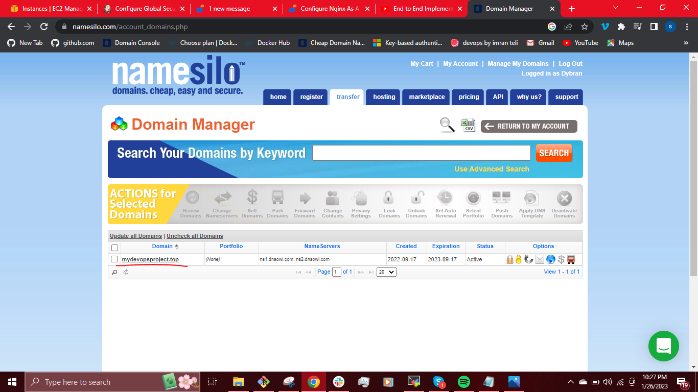
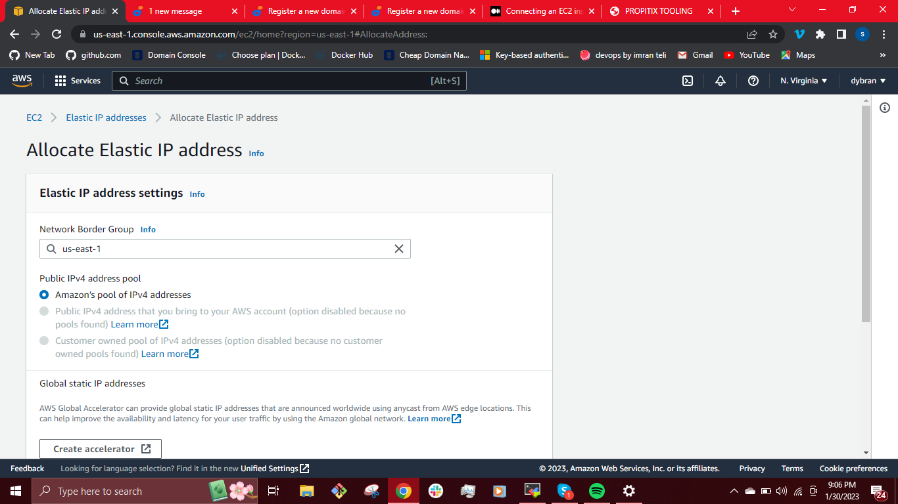
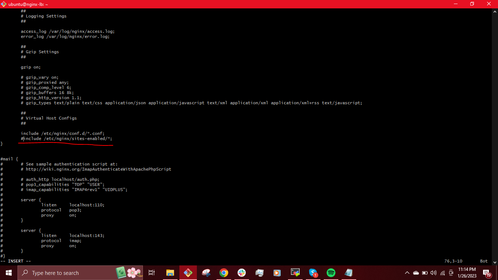

## LOAD BALANCER SOLUTION WITH NGINX AND SSL/TLS ##


_Apache_ and _Nginx_ are two major players in the web server business spanning 5 percent of web traffic over the internet, but they are different from each other.

> The main difference between __Apache__ and __Nginx__ lies in their design architecture. _Apache_ uses a process-driven approach and creates a new thread for each request while _Nginx_ uses an event-driven architecture to handle multiple requests within one thread.

Some of the differences between __Apache__ and __Nginx__ include:

| Apache | Nginx |
| ---- | --- |
|    Apache runs on all Unix like systems such as Linux, BSD, etc. as well as completely supports Windows.  |Nginx runs on modern Unix like systems; however it has limited support for Windows. |
| Apache uses a multi-threaded approach to process client requests. | Nginx follows an event-driven approach to serve client requests. |
| Apache cannot handle multiple requests concurrently with heavy web traffic. | Nginx can handle multiple client requests concurrently and efficiently with limited hardware resources. |
| Apache processes dynamic content within the web server itself | Nginx can't process dynamic content natively. |
| Apache is designed to be a web server. | Nginx is both a web server and a [proxy server](https://www.fortinet.com/resources/cyberglossary/proxy-server). |
| The performance of Apache for static content is lower than Nginx. | Nginx can simultaneously run thousands of connections of static content two times faster than Apache and uses little less memory.


As a DevOps engineer we should be versatile with alternative solutions for our web servers. 

> In this project, we will replace the __Apache__ load balancer in [project-9](https://github.com/dybran/Project-9/blob/main/project-9.md), configure an __Nginx Load Balancer solution__ and also ensure that connections to our Web solutions are secure and information is encrypted in transit – we will make sure that the connection over HTTP is secure __(HTTPS protocol).__

[MITM]:
https://en.wikipedia.org/wiki/Man-in-the-middle_attack

The data moving between a client (browser) and a Web Server over the Internet passes through multiple network devices. If the data is not encrypted, it can be relatively easy to intercept by someone who has access to the intermediate equipment. This kind of information security threat is called [Man-In-The-Middle (MIMT)attack][MITM].

[SSL]:
https://en.wikipedia.org/wiki/Transport_Layer_Security#SSL_1.0,_2.0,_and_3.0


[SSL][SSL] and its newer version, TSL – is a security technology that protects connection from [MITM][MITM] attacks by creating an encrypted session between browser and Web server. Here we will refer this family of cryptographic protocols as SSL/TLS.
[SSL/TLS][SSL] uses [digital certificates](https://en.wikipedia.org/wiki/Public_key_certificate) to identify and validate a Website. A browser reads the certificate issued by a Certificate Authority (CA) to make sure that the website is registered in the CA so it can be trusted to establish a secured connection.

> We will register our website with [LetsEnrcypt](https://letsencrypt.org/) Certificate Authority, to automate certificate issuance you will use a shell client recommended by LetsEncrypt – [certbot](https://certbot.eff.org/).

> This project consists of two parts:

- Configure Nginx as a Load Balancer.
- Register a new domain name and configure secured connection using SSL/TLS certificates.

The target architecture looks like this:


__REGISTER A NEW DOMAIN NAME AND CONFIGURE SECURED CONNECTION USING SSL/TLS CERTIFICATES__

To make necessary configurations to make connections to our Tooling Web Solution secured, we need to get a valid [SSL][SSL] certificate.

First, we need to register a new domain name. We can do it using any Domain name registrar – a company that manages reservation of domain names. godaddy.com and [namesilos.com](https://www.namesilo.com/?rid=3853d48oc). 

> We can choose to use any one but i used [namesilos.com](https://www.namesilo.com/?rid=3853d48oc) for this project.



On the AWS console, search for `route 53`, click on it and create a hosted zone.


Created the hosted zone by filling in the required details of our new domain name.


For our `route 53` to connect to our domain name, we need to copy each of our __nameservers__ from the `route 53` to the domain name on the namesilos.

Copy these details


To these


then click on __"change nameservers".__

when you launch an EC2 instance, you receive a Public IP address by which that instance is reachable from the internet. Once the instance is stoped and restarted, the instance gets a new Public IP for the same instance. So it's basically a problem to connect your instance from internet for not having a static IP. To overcome this problem, we attach an [Elastic IP](https://docs.aws.amazon.com/AWSEC2/latest/UserGuide/elastic-ip-addresses-eip.html) to an Instance.

On the AWS console, Search for __"Elastic IP"__ and click on it.



Click on __"allocate elastic IP address".__ This generates an Elastic IP address.


We click on __'associate this Elastic IP address".__


Select the instance we want to associate to the Elastic IP address. In our case it is the Nginx-LB.


Then click __"associate".__


We go back to the `route 53` and click __"create record"__ using the __Elastic IP__.

We will create [A record](https://www.cloudflare.com/learning/dns/dns-records/dns-a-record/) for `www.mydevopsproject.top` and `mydevopsproject.top` using the same Elastic IP.


This will allow us login using any of the above domain name format.

__CONFIGURE NGINX AS A LOAD BALANCER__

Create an EC2 instance based on Ubuntu Server 20.04 LTS and name it __Nginx-LB__ (do not forget to open TCP port 80 for HTTP connections, also open TCP port 443 – this port is used for secured HTTPS connections).


Update `/etc/hosts` file for local DNS with Web Servers’ names (e.g. __web01__ and __web02__) and their local IP addresses.

`$ sudo vi /etc/hosts`


__Install and configure Nginx as a load balancer to point traffic to the resolvable DNS names of the webservers.__

Update the instance and Install Nginx

`$ sudo apt update -y`

`$ sudo apt install nginx -y`


__Configure Nginx LB using Web Servers’ names defined in__ `/etc/hosts`

Open the default nginx configuration file

`$ sudo vi /etc/nginx/nginx.conf`

Copy and paste the following

```
upstream myproject {
    server Web01 weight=5;
    server Web02 weight=5;
  }

server {
    listen 80;
    server_name www.domain.com;
    location / {
      proxy_pass http://myproject;
    }
  }
  ```

comment out this line `include /etc/nginx/sites-enabled/*;`

i.e __#include /etc/nginx/sites-enabled/*;__ in the above file.




Run the command below to test the configuration and check for any syntax error

`$ sudo nginx -t`


Restart Nginx and make sure the service is up and running

`$ sudo systemctl restart nginx`

`$ sudo systemctl status nginx`


Link the `/etc/nginx/nginx.conf` to the `/etc/nginx/sites-enabled`

`$ sudo rm -rf /etc/nginx/sites-enabled/defaults`

`$ sudo ln -s /etc/nginx/nginx.conf /etc/nginx/sites-enabled`


We then try to access the nginx-LB from the browser using our domain name - `www.mydevopsproject.top` or `mydevopsproject.top`


In the above we will see that the connection is not secured. To configure a secure connection using [SSL/TLS][SSL], 

Install __certbot__ and request for an SSL/TLS certificate.

`$ sudo apt systemctl certbot -y`


Install the dependencies

`$ sudo apt install python3-certbot-nginx -y`


Request a certificate by following the certbot instructions – you will need to choose which domain you want your certificate to be issued for, domain name will be looked up from `nginx.conf`.

`$  sudo certbot --nginx`


Test secured access to your Web Solution by trying to reach `https://www.mydevopsproject.top`

We should be able to access our website by using __HTTPS protocol (that uses TCP port 443)__ and see a padlock pictogram in your browser’s address bar.
When we click on the padlock icon, we can see the details of the certificate issued for our website.


__Set up periodical renewal of your SSL/TLS certificate.__

By default, LetsEncrypt certificate is valid every 90 days, so it is recommended to renew it at least every 60 days or more frequently.

You can test renewal command in __dry-run__ mode.

`$ sudo certbot renew --dry-run`

Best pracice is to have a scheduled job to run renew command periodically.

Let us configure a [cronjob](https://www.youtube.com/watch?v=4g1i0ylvx3A) to run the renewal twice per day. The command checks to see if the certificate on the server will expire within the next 30 days, and renews it if so.

To do so, lets edit the crontab file with the following command:

`$ crontab -e`

`* */12 * * *   root /usr/bin/certbot renew > /dev/null 2>&1`


We just implemented an __Nginx Load Balancing Web Solution with secured HTTPS connection and periodical SSL/TLS certificates update.__


